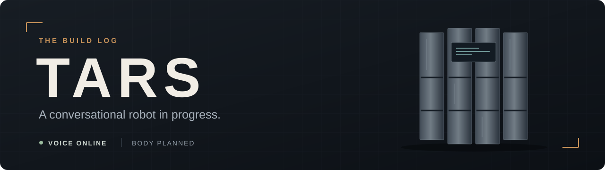
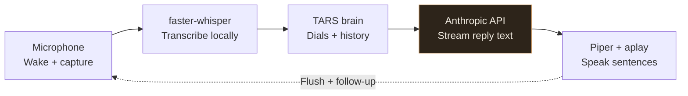

<p align="center">
  
</p>

<p align="center">
  <strong>A Raspberry Pi, a voice, and a personality you can reconfigure mid-conversation.</strong>
</p>

<p align="center">
  <a href="#what-works-today">Features</a> ·
  <a href="#inside-the-voice-loop">Architecture</a> ·
  <a href="#making-him-faster">Performance</a> ·
  <a href="#run-the-text-interface">Get started</a> ·
  <a href="#next-on-the-bench">Roadmap</a>
</p>

# TARS

I'm building a conversational robot inspired by TARS from *Interstellar*, starting with the software that makes him listen, respond, and sound like a character. The current prototype runs on a Raspberry Pi 5: wake-word detection, speech recognition, streamed replies, local speech synthesis, and adjustable personality all work together.

**Current stage: working voice prototype.** The articulated body, servo control, and sensors are planned. Today's engineering work is in Python, Linux, audio processing, API integration, and performance measurement.

## What works today

- **Wake once, keep talking.** Say “Hey Jarvis,” then ask follow-up questions without repeating the wake word. After eight seconds without speech, TARS returns to listening for it.
- **Speak as sentences arrive.** The voice interface starts synthesizing complete sentences from the response stream before collecting the entire reply.
- **Keep the voice loaded.** Piper initializes once at startup and is reused throughout the session.
- **Change his personality live.** Four application-owned dials shape the next response, with presets and conversational acknowledgments.
- **Remember the conversation.** History survives wake/sleep cycles for the lifetime of the process.
- **See where the time goes.** Logs expose transcription time, first text, first speech chunk, synthesis, playback, and gaps between playback calls.

Wake-word detection, transcription, and speech synthesis run locally. Response generation uses the Anthropic API and requires internet access; the application sends conversation text to that API.

## Inside the voice loop



The current playback loop is synchronous: playing one sentence delays reading and synthesizing the next. Remote generation can continue while the client plays audio, subject to stream buffering. Preparing audio during playback is a next step.

| File | Responsibility |
| :--- | :--- |
| [`personality.py`](personality.py) | Pure command parsing, presets, and prompt construction. |
| [`brain.py`](brain.py) | Owns personality state, conversation history, and API streaming. |
| [`tars.py`](tars.py) | Terminal interface; collects streamed text into a complete reply. |
| [`tars_voice.py`](tars_voice.py) | Audio capture, wake/follow-up loop, sentence splitting, synthesis, playback, and timing. |

Three decisions shape the implementation:

**State lives in Python.** The model receives the current dial values on every request. Configuration changes are parsed by the application.

**Commands and conversation take separate paths.** Command events enter the system prompt, while history preserves the user's actual words.

**Each interface owns its presentation.** The brain yields text deltas. The voice interface splits and sanitizes them for speech; the terminal interface joins them for display.

## Personality, with actual state

| Dial | Baseline | Controls |
| :--- | ---: | :--- |
| Humor | 75 | Seriousness versus playfulness |
| Sarcasm | 60 | Sincerity versus dry edge |
| Honesty | 90 | Diplomatic versus blunt phrasing |
| Intellect | 50 | Vocabulary and register |

All dials range from 0 to 100. These are style controls, not guarantees of factual accuracy or changes to the model's underlying capabilities.

Try these in the text interface:

```text
set humor to 90
buddy mode
know-it-all
what are your settings?
reset
```

The same parser handles transcribed speech. Spoken number words and variations such as “know it all” still need better normalization. Voice delivery, including the occasional flat “Huh,” is being tuned.

## Making him faster

The first major win came from changing the lifetime of a resource: the old speech path launched Piper and loaded the voice model for every reply. Reusing a loaded `PiperVoice` removed about **two seconds per call** in a paired benchmark on the Pi 5.

| Input | Fresh Piper process | Loaded voice reused | Time saved |
| :--- | ---: | ---: | ---: |
| Short: “Test.” | 2.107 s | **0.051 s** | 2.056 s · **97.6%** |
| Paragraph producing about 10 s of audio | 3.234 s | **1.133 s** | 2.101 s · **65.0%** |

These are median **WAV-generation times**, with four measured trials per input and method, warm-ups excluded, and execution order alternated. They do not measure complete conversational latency.

In the first live streaming session, the estimated interval from detected speech end to the first playback request was **4.54–9.52 seconds across four turns**. Two turns were below five seconds; transcription and response-stream delays still caused longer waits. The metric excludes playback startup and is not a measurement of the first audible sound.

See the [performance notes](docs/performance.md) for measurements, boundaries, and remaining questions.

## On the bench

| Layer | Current implementation |
| :--- | :--- |
| Computer | Raspberry Pi 5, 8 GB, active cooling |
| Operating environment | Debian 13, 64-bit ARM; Python 3.13; headless over SSH |
| Audio | USB microphone/audio interface and speaker; PortAudio capture and ALSA playback |
| Wake word | openWakeWord 0.4.0, “Hey Jarvis” ONNX model |
| Transcription | faster-whisper `base`, CPU, INT8 |
| Response generation | `claude-sonnet-4-6`, Anthropic SDK 0.111.0 |
| Speech synthesis | Piper 1.8.0, `en_US-ryan-medium`, loaded once |

## Run the text interface

The text interface lets you explore the personality system without audio hardware. You need Python and an Anthropic API key with API access.

```bash
git clone https://github.com/lucaformento/TARS.git
cd TARS
python3 -m venv venv
source venv/bin/activate
python -m pip install "anthropic==0.111.0" python-dotenv
```

Create a `.env` file in the project root:

```dotenv
ANTHROPIC_API_KEY=your_key_here
```

Then run:

```bash
python tars.py
```

Type `quit` to exit. `.env` is excluded from version control. The current character prompt addresses its builder, Luca; customize it in `personality.py` for your own build.

**For the microphone and speaker:** follow the [voice setup notes](docs/voice-setup.md). Model files and audio configuration are provisioned separately; a fresh clone is not yet a one-command hardware setup.

## Next on the bench

- [x] Shared brain with text and voice interfaces
- [x] Personality dials and session history
- [x] Wake word and follow-up conversation loop
- [x] Resident Piper voice and sentence streaming
- [x] Timing instrumentation and paired synthesis benchmark
- [ ] Measure first-transcription overhead and compare STT options
- [ ] Smooth sentence transitions and tune vocal delivery
- [ ] Improve spoken-command parsing and failure recovery
- [ ] Package repeatable voice setup and add a demo recording
- [ ] Add a custom “Hey TARS” wake word and startup service
- [ ] Build the articulated body, servo control, and sensors

The prototype currently waits until playback finishes before listening again. Background noise can interfere with speech detection, and history resets when the process stops. Those constraints guide the next round of work.

---

Built by [Luca Formento](https://github.com/lucaformento). An independent project inspired by *Interstellar*.
