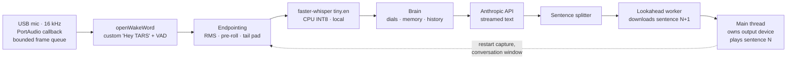

<p align="center">
  
</p>

# TARS

A voice-driven conversational robot inspired by TARS from *Interstellar*, running
on a Raspberry Pi 5. Wake-word detection and speech recognition run on the
device; response generation streams from the Anthropic API; speech is
synthesized sentence-by-sentence through ElevenLabs (or local Piper) with
one-sentence lookahead. The robot has application-owned personality state and a
persistent, user-correctable memory. The articulated body is the next phase.

**Status:** working voice prototype, validated live on the Pi. 127 offline tests.

## System overview


```mermaid
flowchart LR
    mic["USB mic · 16 kHz<br/>PortAudio callback<br/>bounded frame queue"] --> wake["openWakeWord<br/>custom 'Hey TARS' + VAD"]
    wake --> cap["Endpointing<br/>RMS · pre-roll · tail pad"]
    cap --> stt["faster-whisper tiny.en<br/>CPU INT8 · local"]
    stt --> brain["Brain<br/>dials · memory · history"]
    brain --> llm["Anthropic API<br/>streamed text"]
    llm --> split["Sentence splitter"]
    split --> worker["Lookahead worker<br/>downloads sentence N+1"]
    worker --> play["Main thread<br/>owns output device<br/>plays sentence N"]
    play -. "restart capture,<br/>conversation window" .-> cap
```

One turn:

1. **Wake.** The input stream runs a PortAudio callback that enqueues 80 ms
   frames into a bounded queue (3 s). The main thread runs openWakeWord on each
   frame (threshold 0.5, VAD-gated at 0.5, 2 s post-sleep cooldown).
2. **Capture.** An RMS endpointer, calibrated at startup to `max(3 × ambient
   median, 150)`, keeps 0.5 s of pre-roll, ends after 1.2 s of silence, pads a
   0.5 s tail, rejects bursts with under 0.4 s of loud frames, and caps an
   utterance at 30 s. Queue drops and PortAudio overflows are counted per
   capture; a damaged capture is never transcribed — TARS asks for a repeat.
3. **Transcribe.** Capture is **stopped** for STT, generation, and playback.
   This prevents USB input overruns and speaker echo, at the cost of
   interruption (see [limitations](#limitations)). Whisper gets a vocabulary
   hint (TARS, the mode and dial names), and the name is always written TARS.
4. **Generate.** The brain rebuilds the system prompt on every request from
   current dial values, a bounded memory block, and an optional one-turn
   control event, then streams text deltas.
5. **Speak.** Deltas are split into sentences. A worker thread downloads
   sentence N+1 as complete PCM while the main thread plays sentence N; it never
   prepares two ahead. After the reply, capture restarts with a clean buffer.
6. **Stay in the conversation.** For 30 s after each reply TARS answers
   anything, with no wake word. Then he keeps listening but answers only
   sentences that include "TARS" ("what do you think, TARS?"); everything else
   is transcribed locally and dropped. "Go to sleep", or 10 minutes without
   anyone talking to him, returns him to wake-word standby with a short spoken
   line. Coughs, laughs, and blank transcripts never end a conversation.

## Design decisions

**State lives in the application, not the model.** Personality dials, presets,
memory, and conversation history are Python state. The model receives them
fresh each request; commands are parsed locally and reach the model as a
one-turn control event, while history keeps the user's literal words.

**Full-sentence buffering before playback.** Each ElevenLabs sentence is fully
downloaded before the device write, so network jitter can never underflow the
output. Live data showed streaming within a sentence would gain little: across
nine replies, the full sentence arrived on average 0.06 s after its first PCM
byte, so time-to-first-byte dominates.

**Single owner for the audio device.** Only the main thread opens, writes,
stops, or aborts the output stream; the lookahead worker only downloads. An
earlier version let the worker abort the device after a failed download. Under
a deliberate 20 s HTTPS outage this blocked the main thread inside PortAudio
`poll()` indefinitely, unkillable by Ctrl+C (confirmed with a gdb backtrace).
Moving all device control to one thread fixed it; the same outage test now
recovers cleanly.

**Fail the turn, not the process.** Any error inside a turn — Anthropic
timeout or overload, ElevenLabs failure, PortAudio playback error, Whisper
failure — ends that turn, prints a one-line reason, and returns to wake-word
listening with capture restarted. The one fatal condition is a microphone
stream that cannot restart, because continuing would leave TARS deaf.

**History stays well-formed under failure.** A request that fails before any
text removes its orphaned user turn; an interrupted reply is kept as a
complete user/assistant pair. History is capped at 24 messages and pruned in
pairs.

## Memory

A single human-readable JSON file (`memory.json`, git-ignored), designed so a
guess can never silently become a fact.

| Source | How it is created | Prompt label |
| :--- | :--- | :--- |
| Explicit | "remember that I prefer PETG", "remember I work nights" | `CONFIRMED` |
| Quiet note | After a reply has been generated and played in full, Claude Haiku 4.5 judges whether the exchange holds one durable fact about Luca ("still true and useful a month from now?") | `UNCONFIRMED` |
| Running joke | "remember that" right after a TARS line | `RUNNING JOKE` |

- **Retrieval is bounded:** confirmed before inferred, newest first, at most 20
  entries and 1,200 characters; entries are capped at 240 characters and the
  store at 500 (oldest inferred entries are evicted first, explicit ones never).
- **Quiet notes are proposals, not decisions.** The model only proposes an
  action. Local code then decides whether it applies:
  - It validates the output against a strict schema.
  - A secret guard rejects passwords, PINs, codes, and account or card numbers,
    including spoken digits.
  - A note is dropped if any explicit memory command ran after its turn. A
    delayed note therefore can never undo a "forget that".

  Notes run on a background worker after playback, never on the reply's path,
  and a failure changes nothing. The note request sends Anthropic the same
  bounded memory block the reply already sent. It never sends the whole
  store.
- **Check-ins:** at most once per local day, TARS may ask about one directly
  relevant guess ("You mentioned a printer in November. Still the plan?").
  - **Enforcement:** the daily allowance is reserved in a private state file
    before generation.
  - **Marking:** the question must begin with a marker that is removed before
    speech, and any extra or malformed marked sentence is suppressed.
  - **Answers:** "yes" or "no" counts only on the next turn of the same wake,
    and only for that exact entry. A yes upgrades it to `CONFIRMED`; a no
    deletes it.
- **Honesty:** TARS is told that only the application changes memory. If Luca
  asks to remember or forget something and nothing changed, a control note
  says so and gives the exact wording to use.
- **Corrections:** "forget that I like PETG" deletes one unambiguous match;
  ambiguous requests delete nothing and ask for specifics. A bare "forget that"
  deletes only the newest memory saved since TARS started and names it; with
  nothing saved this run it deletes nothing and gives the exact phrase instead.
  "Forget it" never deletes. Re-stating an inferred entry upgrades it to
  `CONFIRMED`.
- **Durability:** writes go to a temp file, `fsync`, then atomic `os.replace`.
  A failed write leaves memory and disk unchanged, and TARS is told not to claim
  success. An unparsable file is quarantined, never overwritten; an unreadable
  one disables writes.
- **Prompt hygiene:** memory text is framed as data, not instructions, and
  whitespace is collapsed so an entry cannot forge additional lines.
- Whisper often transcribes the wake phrase; one leading "Hey TARS" is stripped
  before command parsing.

## Personality

Four dials (0–100) are injected as style guidance, never recited unless asked:
humor (75), sarcasm (60), honesty (90), intellect (50). Two presets set all
four: **buddy mode** (90/70/80/20) and **know-it-all** (20/30/100/95). The
current mode (baseline, a preset, or custom) is named in the prompt, and
changes are kept in `personality-state.json` (outside Git) until reset.

Commands are parsed locally from text or speech, so they are instant and free:

| Say | Effect |
| :--- | :--- |
| `set humor to ninety`, `make your humour 90`, `humor 90%` | Set one dial |
| `be funnier`, `less sarcastic`, `turn your humor up` | Move one dial by 10 |
| `switch to buddy mode`, `turn on know-it-all mode` | Switch preset |
| `turn off buddy mode`, `back to normal`, `reset your settings` | Baseline |
| `what mode are you in`, `what are your settings` | Read them out |

A leading "Hey TARS," and politeness ("can you … please") are fine. Apart from
"set … to N", a command must be the whole utterance, so ordinary speech that
merely mentions "humor" or "settings" changes nothing. Wording that sounds like
a settings request but does not parse gets an honest control note: nothing
changed, plus a phrase that works.

## Measured performance

Live session on the Pi (September 30, 2026; ElevenLabs, `claude-sonnet-4-6`):

| Metric | Result |
| :--- | :--- |
| Turns / wakes | 7 turns across 2 wakes; both wakes on the first attempt |
| Input overflows / output underflows | 0 / 0 |
| Gap between spoken sentences | 11 of 13 at 0.00 s; max 0.05 s |
| Long utterance | 21.7 s clip transcribed in full, ended on silence |
| End of speech → first playback request | 4.9–8.5 s |
| Network-outage recovery (20 s HTTPS block mid-reply) | reported, slept, woke and answered normally, clean exit |

First-response latency breakdown: ~1.2 s endpoint silence, 1.6–4.5 s Whisper
(fit: **1.40 s fixed + 0.14 s per second of audio** — the fixed part is the
encoder's padded 30 s window), ~1.3 s to Claude's first complete sentence, and
1.2–1.5 s ElevenLabs time-to-first-byte. The reduction plan, ranked by expected
savings and risk, is in [docs/latency-proposal.md](docs/latency-proposal.md).

Those figures were measured with `base` at beam 5. On the same 11 recorded
clips, `tiny.en` with beam 1 produced the same transcripts at a median 0.88 s
decode (max 1.53 s) against 1.87 s (max 4.07 s), so it is now the default.

Earlier, keeping the Piper voice resident instead of spawning it per reply cut
synthesis from ~2.1 s to 0.05 s for a short line
([performance notes](docs/performance.md)).

## Privacy boundaries

- **Microphone audio never leaves the Pi.** Wake detection and STT are local.
- The transcript, dials, and the bounded memory block go to Anthropic.
- Only generated reply text (plus up to 500 characters of same-reply context)
  goes to ElevenLabs. The API key is never forwarded on redirects, and errors
  are sanitized before display.
- Opt-in capture diagnostics (`--capture-diagnostics`) refuse any path inside
  the repository and write WAV/JSON files with `0700`/`0600` permissions.
- While TARS waits for his name, overheard sentences that do not include it are
  transcribed locally and dropped: never printed, saved, or sent anywhere.

## Hardware and stack

| Layer | Implementation |
| :--- | :--- |
| Compute | Raspberry Pi 5, 8 GB, active cooling; Debian 13 (aarch64); Python 3.13 |
| Audio | USB microphone (matched by device name) and speaker; PortAudio via `sounddevice`, 200 ms latency both directions |
| Wake word | openWakeWord 0.4.0, custom "Hey TARS" ONNX model; 9/9 detections in clean Pi trials |
| STT | faster-whisper 1.2.1, `tiny.en`, beam 1, CPU INT8 |
| LLM | Anthropic SDK 0.111.0; default `claude-sonnet-4-6`; 20 s timeout, 1 retry; 160 output tokens for voice |
| TTS | ElevenLabs `eleven_multilingual_v2` with a designed synthetic voice (not a clone), speed 0.92, 85% volume; 24 kHz s16le PCM; Piper 1.8.0 as the local fallback |

## Repository layout

| Path | Responsibility |
| :--- | :--- |
| [`tars_voice.py`](tars_voice.py) | Voice front end: capture, endpointing, wake and name-aware conversation loop, sentence lookahead, recovery, diagnostics |
| [`transcript.py`](transcript.py) | Pure transcript handling: Whisper hint, TARS spelling, addressing and "go to sleep" |
| [`cloud_speech.py`](cloud_speech.py) | ElevenLabs client: bounded PCM download, playback, cancellation; voice list/audition/configure CLI |
| [`brain.py`](brain.py) | Request construction, streaming, history consistency, model selection |
| [`memory.py`](memory.py) | Memory store, command parsing, inference, bounded retrieval |
| [`personality.py`](personality.py) | Pure prompt building and dial/preset command parsing |
| [`tars.py`](tars.py) | Terminal front end for the same brain |
| [`tests/`](tests) | 252 offline tests with fake devices, network, and models |
| [`docs/`](docs) | Decision record, measurements, and design notes |

## Running it

Developed on Python 3.13; requires an Anthropic API key. The terminal
interface needs no audio hardware:

```bash
git clone https://github.com/lucaformento/TARS.git && cd TARS
python3 -m venv venv && source venv/bin/activate
pip install anthropic==0.111.0 python-dotenv
echo "ANTHROPIC_API_KEY=..." > .env
python tars.py                      # optional: --brain-model claude-sonnet-5
```

The voice front end additionally needs `numpy`, `sounddevice` (with PortAudio),
`faster-whisper`, `openwakeword==0.4.0`, `piper-tts`, and locally provisioned
models (not distributed; see [voice setup](docs/voice-setup.md)). For
ElevenLabs, configure a key and voice with `python cloud_speech.py configure
--voice-id VOICE_ID --save` ([cloud voice](docs/cloud-voice.md)).

```bash
python tars_voice.py --tts elevenlabs                # converse
python tars_voice.py --tts elevenlabs --diagnostics  # per-turn timing, overflow, underflow report
python cloud_speech.py audition --voice-id VOICE_ID  # one paid sample
```

| Variable | Purpose |
| :--- | :--- |
| `ANTHROPIC_API_KEY` | Required |
| `ANTHROPIC_MODEL` | Optional; one of `claude-sonnet-4-6`, `claude-sonnet-5`, `claude-haiku-4-5-20251001` |
| `ELEVENLABS_API_KEY`, `ELEVENLABS_VOICE_ID` | Required for `--tts elevenlabs` |
| `ELEVENLABS_MODEL_ID` | `eleven_multilingual_v2` (default) or `eleven_flash_v2_5` |
| `ELEVENLABS_SPEED`, `TARS_VOLUME` | Delivery overrides; defaults `0.92` (8% slower) and `0.85` (15% quieter) |
| `TARS_MEMORY_NOTES` | `0` turns off model-judged notes and check-ins and returns to pattern inference |
| `TARS_STT_MODEL`, `TARS_STT_BEAM` | Speech recognition; defaults `tiny.en` and `1`; `base` and `5` restore the earlier setting |

Tests (no network, audio device, or API key needed):

```bash
python -m unittest discover -s tests
```

## Limitations

- **First-response latency (4.9–8.5 s)** is the main open problem; see the
  latency plan above.
- **No barge-in.** Capture is paused while TARS thinks and speaks. Interruption
  and a wake acknowledgment both need continuous capture with speaker-echo
  control.
- The wake word accepts some near phrases ("hey stars"); this was a deliberate
  trade-off for recall.
- Whisper can mishear short, quiet phrases and some words ("servo" as "server").
- Memory commands must be the whole utterance (leading fillers such as "yeah,
  just" are fine), and Whisper sometimes hears "forget them," which never
  deletes. Whether the note-taker rejects trivia is judged in live use, not by
  the offline tests.
- While TARS waits for his name, capture pauses for about a second to
  transcribe each overheard sentence, so a name spoken right after someone
  else stops can be clipped.
- Memory notes assume the speaker is Luca; a guest's facts can be noted as
  unconfirmed guesses about him (check-ins let him reject them).
- Conversation history is process-local; memory and personality settings
  persist across restarts.
- Model and device paths are configured for this Pi; a portable install script
  and lockfile do not exist yet.

## Roadmap

- [x] Wake word, follow-up loop, and streamed sentence speech
- [x] Name-aware conversation flow and forgiving personality commands (pending live acceptance)
- [x] One-sentence lookahead with zero-gap transitions
- [x] Persistent memory with confirmed/inferred provenance
- [x] Turn-level failure recovery, verified under a live network outage
- [x] Same-clip speech-recognition benchmark; `tiny.en` at beam 1 adopted
- [ ] First-response latency: endpoint tuning, Flash TTS for sentence one
- [x] Designed TARS-style voice, tuned by ear on the Pi speaker
- [ ] Optional "machine body" output filter
- [x] Model-judged memory notes with daily check-ins (pending live acceptance)
- [ ] Continuous capture with echo control for barge-in
- [ ] Articulated, 3D-printed body with servo control

---

Built by [Luca Formento](https://github.com/lucaformento). An independent project inspired by *Interstellar*.
